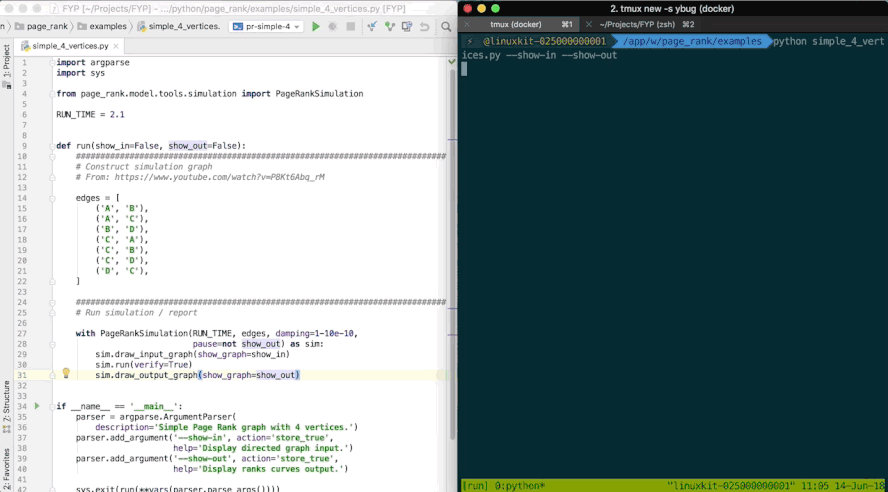

# FYP

Final Year Project investigating alternative applications of the SpiNNaker 
hardware. Currently, the focus is on graph based algorithms such as Page Rank.

## Tooling w/ Docker images

[](https://travis-ci.com/louisblin/FYP)

We build the following docker images to facilitate the development w/ sPyNNaker:

- [**louisleblin/pynn8**](https://hub.docker.com/r/louisleblin/pynn8/):
environment to run the PyNN 0.8 interface to sPyNNaker
- [**louisleblin/toolchain:v2016.001**](https://hub.docker.com/r/louisleblin/toolchain-v2016/):
environment for SpiNNaker Graph Front End Developer toolchain v2016.001
- [**louisleblin/toolchain:v4.0.0**](https://hub.docker.com/r/louisleblin/toolchain-v2016/):
same, but v4.0.0

These images are available under the two versions, accessible via a specific 
tag:

- **prod** version, via _``_ for the slim version of the image
- **dev** version, via _`:[<tag>-]dev`_ which adds some development tools 
such as
`vim` and loads a custom `zsh` / `oh-my-zsh` shell - see
`docker/common/Dockerfile-dev` for further details.

##### Usage

The toolchain v4.0.0 w/ the directory of examples mounted can be started as 
follows:

```sh
./scripts/start_container louisleblin/toolchain:v4.0.0-dev --volume $PWD/python:/app/w
```

##### Developing

Consider sourcing `./scripts/set_env` in your `.<shell>rc` to add the scripts 
to your `PATH`. 


## Page Rank on SpiNNaker

### Page Rank Model (`python/page_rank/model`)

We adapt the existing `SpiNNakerManchester/sPyNNaker` spiking neural network 
framework to support Page Rank simulations. Neurons become vertices, synapses 
are now message dispatchers that propagate rank updates along edges. The model 
is constituted of:

* `c_models`: the C implementation of the model, which runs on SpiNNaker.
* `python_models`: the Python specification of a Page Rank simulation.
* `tools/simulation.py`: a unique interface that exposes a user-friendly
 `PageRankSimulation` class that does all the heavy lifting. 
 
### Examples (`python/page_rank/examples`)

To run an `python/page_rank/examples/<example_name>.py`, use:

```sh
# Starts the toolchain container in interactive mode
./scripts/start_container louisleblin/toolchain:v4.0.0-dev --volume $PWD/python:/app/w

...

# In the container
cd page_rank/examples
make <example_name>
```

or as a one-liner:

```sh
./scripts/start_container louisleblin/toolchain:v4.0.0-dev --volume $PWD/python:/app/w --rm --exec "make -C page_rank/examples <example_name>"
```

##### Page Rank on [`simple_4_vertices`](python/page_rank/examples/simple_4_vertices.py)

The following caption shows how the `toolchain:v4.0.0-dev` can be used to 
compute Page Rank on a simple graph as described in 
[this video](https://www.youtube.com/watch?v=P8Kt6Abq_rM). First, the input 
graph is displayed to visually confirm its structure. Then, Page Rank is 
computed on SpiNNaker and an output graph is displayed, showing the evolution 
over time of the rank of each node.

Additionnally, a Python implementation of Page Rank runs on the same graph and 
is used to ensure the results obtained are correct.



